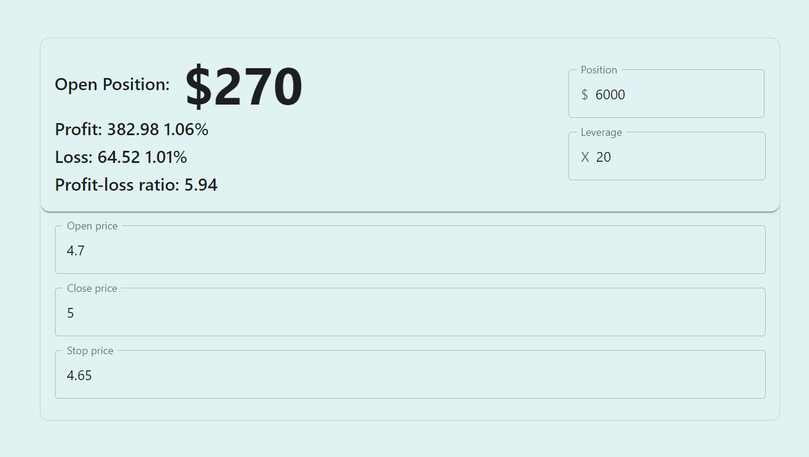

# trading-position-calculator

For day traders to use, quick calculation of leverage and stop loss.

todo:
- Complete backend program to input chart data and render.
- Integrated with OKEX API, open position in front of one click for fast trading.
- Provide manual stop profit stop loss and automatic quantization procedures.

